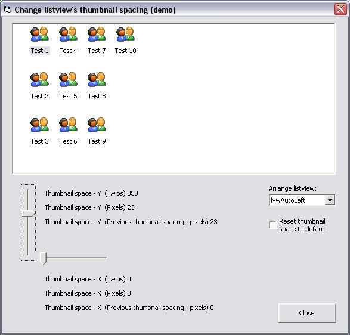

<div align="center">

## ListView Icon Spacing


</div>

### Description

This is a demo which shows how to control the icon spacing in a listview's icon view. The demo is an easy to use wrapper around the LVM_SETICONSPACING api message. You only need to submit the x, y icon spacing in twips and then the code does the rest of it.
 
### More Info
 


<span>             |<span>
---                |---
**Submitted On**   |2007-05-20 20:20:56
**By**             |[The typist](https://github.com/Planet-Source-Code/PSCIndex/blob/master/ByAuthor/the-typist.md)
**Level**          |Intermediate
**User Rating**    |5.0 (15 globes from 3 users)
**Compatibility**  |VB 5\.0, VB 6\.0
**Category**       |[Windows API Call/ Explanation](https://github.com/Planet-Source-Code/PSCIndex/blob/master/ByCategory/windows-api-call-explanation__1-39.md)
**World**          |[Visual Basic](https://github.com/Planet-Source-Code/PSCIndex/blob/master/ByWorld/visual-basic.md)
**Archive File**   |[ListView\_I2066575202007\.zip](https://github.com/Planet-Source-Code/the-typist-listview-icon-spacing__1-68635/archive/master.zip)

### API Declarations

```
Option Explicit
'
' Listview api messages.
Private Const LVM_FIRST As Long = &amp;H1000
Private Const LVM_SETICONSPACING = LVM_FIRST + 53
Private Declare Sub CopyMemory Lib "kernel32" Alias "RtlMoveMemory" (Destination As Any, Source As Any, ByVal Length As Long)
Private Declare Function SendMessage Lib "user32" Alias "SendMessageA" (ByVal hwnd As Long, ByVal wMsg As Long, ByVal wParam As Long, lParam As Any) As Long
```


